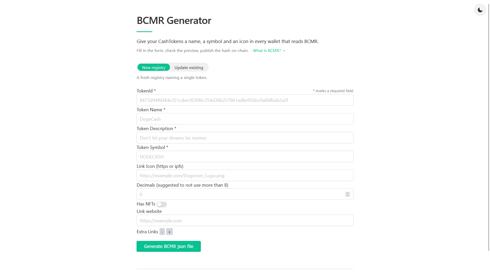
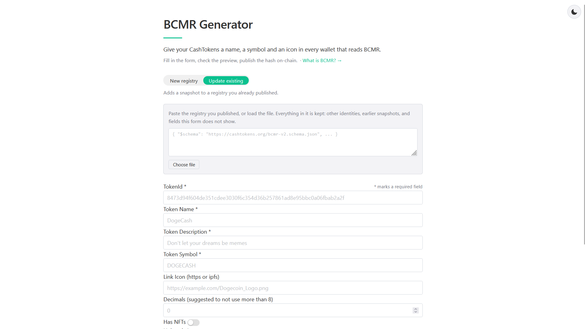

# BCMR Generator

Fill-in form to create the [BCMR](https://github.com/bitjson/chip-bcmr) Json file for a CashTokens project! Deployed at [bcmr-generator.app](https://bcmr-generator.app/).

This Json file can then be hosted on the web on a domain name you control or can be pinned on IPFS.

There are two modes.

**New registry** writes a fresh registry naming a single token.



**Update existing** takes a registry you already published, adds a new snapshot to it, and bumps the version by the spec's rule. Everything already in the file is kept, including other identities, earlier snapshots and fields the form does not show. The hash of the file you loaded is shown next to the hash of the new one, so you can see what is currently committed on-chain and what you are about to publish.



Both modes have an **Advanced** switch for when you are not self-publishing one token but maintaining a registry. It lets you name the registry itself, rather than having that derived from the token name, or identify it on-chain by authbase instead. It also turns off the token block, so you can describe a person, organization, dapp or contract system: the spec's identities are not only tokens, and nothing else writes those files today. And it lets one registry name several identities, each on its own tab.

## Project Setup

```sh
pnpm install
```

### Run Locally

```sh
pnpm dev
```

## Documentation

🗺️ For an overview of the architecture, see [CLAUDE.md](./CLAUDE.md): written to guide AI agents, it doubles as the codebase's architecture documentation.

📖 The [`docs`](./docs) folder covers the BCMR standard itself: [the registry files this generator writes](./docs/bcmr-registries.md) explains the identity model behind [CHIP-BCMR](https://github.com/bitjson/chip-bcmr), which parts of the output are the spec and which are this generator's own convention, the two NFT commitment encodings, and what the standard allows that the generator does not do yet.

## Legacy version

🪦 The generator began as a vanilla-JavaScript page, since superseded by this one. The archived [legacy codebase](https://github.com/mr-zwets/bcmr-generator-vanillaJS) is still on GitHub.

